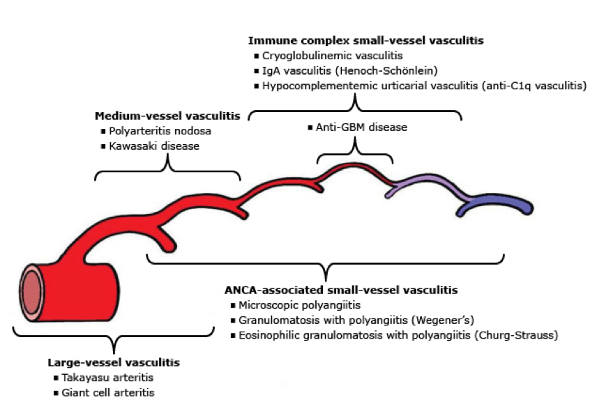

# Cardiovascular System & Cardiology

## Fetal Circulation

## Heart Development

|Mnemonic|Embryonic Structure|Give Rise To|
|-|-|-|
|Small|Sinus venosus|Smooth part of RA & Coronary sinus|
|Pump|Primitive atrium|Trabeculated part of RA & LA|
|Produces|Primitive ventricle|Trabeculated part of RV & LV|
|Big|Bulbus cordis|Smooth part of RV & LV|
|Turbulence|Truncus arteriosus|Aortic & Pulmonary trunk|

## Layers of Arteries

|Layer|Elastic Artery|Muscular Artery|Arteriole|
|-|-|-|-|
|Tunica adventitia|+|+|+|
|External elastic layer|-|Elastin|-|
|Tunica media|Elastin|Smooth muscle|Smooth muscle|
|Internal elastic layer|-|Elastin|-|
|Tunica intima|+|+|+|

## Action Potential of Cardiac Muscle Cells

|Phase|SA & AV Nodes|Atria & Ventricles|
|-|-|-|
|0|Ca current|Na current|
|1|-|K current|
|2|-|Ca & K current|
|3|K current|K current|
|4|Funny current: Na & K current|Leak current: K current|

## Effects of Adrenergic Agents on Cardiovascular System

|Agent|CO|SVR|MAP|
|-|-|-|-|
|α1|↓|↑ (1°)|↑|
|α2|↓|↓|↓|
|β1|↑ (1°)|-|↑|
|β2|↑|↓ (1°)|↓|
|Dopamine: D > β1 > α1|↑ (1°)|-|↑|
|Dobutamine: β1 > β2|↑ (1°)|↓|↑|
|Norepinephrine: α1 > β1|-|↑ (1°)|↑|
|Epinephrine: β > α1|↑ (1°)|-|↑|
|Isoproterenol: β|↑ (1°)|↓ (1°)|-|

## Stroke Volume is Influenced by [CAP]

- Contractility
- Afterload
- Preload

## Cardiac and Vascular Function Curves

|Label|Examples|
|-|-|
|1|Catecholamines & Digoxin|
|2|Heart failure & Narcotics|
|3|Venopressors & Infusion|
|4|Venodilators & Hemorrhage & Spinal anesthesia|
|5|Vasopressors|
|6|Vasodilators & AV shunt|

## Classification of Shocks

|Shock|PCWP|CO|SVR|MAP|Treatments|
|-|-|-|-|-|-|
|Hypovolemic|↓ (1°)|↓|↑|↓|Fluids|
|Cardiogenic|↑|↓ (1°)|↑|↓|Inotropes & Diuretics & Venodilators|
|Distributive|-|↑|↓ (1°)|↓|Vasopressors|
|Neurogenic|↓|↓ (1°)|↓ (1°)|↓|Vasopressors|

## Classification of Hypovolemic Shock

|Class|Loss|HR|BP|RR|Urine|
|-|-|-|-|-|-|
|I|< 15%|< 100|-|12 ~ 20|> 30 mL/h|
|II|15 ~ 30%|100 ~ 120|-|20 ~ 30|20 ~ 30 mL/h|
|III|30 ~ 40%|120 ~ 140|↓|30 ~ 40|5 ~ 15 mL/h|
|IV|> 40%|> 140|↓|> 35|< 5 mL/h|

## Classification & Etiologies of Edema

|Edema|Causes|Pitting|
|-|-|-|
|Exudate|Inflammation|+|
|Lymphedema|Lymphatic obstruction|-|
|Transudate|Hydrostatic pressure|+|
||Oncotic pressure|+|

## Virchow Triad [SHE]

- Stasis of blood flow
- Hypercoagulability
- Endothelial injury

## Physical Examination Findings

|Finding|Indications|
|-|-|
|Pulsus paradoxus|Cardiac tamponade & Obstructive lung disease|
|Pulsus parvus et tardus|Aortic stenosis|
|Pulsus alternans|LV systolic dysfunction|
|Differential cyanosis: lower limbs|Eisenmenger syndrome|
|Reverse differential cyanosis: upper limbs|Transposition of great artery (TGA)|
|Kussmaul sign|Cardiac tamponade & Right heart failure & Restrictive cardiomyopathy|

## Grading of Murmurs

|Grade|Thrill|Stethoscope|
|-|-|-|
|1|-|Against|
|2|-|Against|
|3|-|Against|
|4|+|Against|
|5|+|Partially off|
|6|+|Completely off|

## Heart Echo Positions and Views

## Heart Sounds

|Heart Sound|Synonym|Causes|Examples|
|-|-|-|-|
|S1|-|MV & TV close|-|
|S2|-|AV & PV close|-|
|S3|-|MV & TV open|-|
||Opening snap|Volume overload|HF & DCMP & MR & TR|
|S4|Atrial kick|Diastolic dysfunction|HF & HCMP|

## Cyanotic Heart Defects [5T1H]

- Truncus arteriosus
- Transposition of great artery (TGA)
- Tricuspid atresia
- Tetralogy of Fallot (TOF)
- Total anomalous pulmonary venous return (TAPVR)
- Hypoplastic left heart syndrome (HLHS)

## Congenital Heart Defect & Central Cyanosis

||Obligatory Shunt|Cyanosis|
|-|-|-|
|Truncus arteriosus|-|Non-differential|
|Transposition of great artery (TGA)|ASD / VSD / PDA|Reverse differential|
|Tricuspid atresia|ASD & VSD / PDA|Non-differential|
|Tetralogy of Fallot (TOF)|VSD & PDA|Non-differential|
|Total anomalous pulmonary venous return|ASD / VSD / PDA|Non-differential|
|Hypoplastic left heart syndrome|ASD & PDA|Non-differential|
|Eisenmenger syndrome of ASD|-|Non-differential|
|Eisenmenger syndrome of VSD|-|Non-differential|
|Eisenmenger syndrome of PDA|-|Differential|

## Tetralogy of Fallot (TOF) [PROV]

- Pulmonary stenosis
- RV hypertrophy
- Overriding aorta
- Ventricular septal defect

## Atrial Septal Defects (ASD)

.png)

## Ventricular Septal Defects (VSD)

.png)

## Heart Failure

||HFrEF|HFpEF|
|-|-|-|
|LVEDV|↑|↓|
|LVESV|↑|↓|
|SV|↓|↓|
|LVEF|↓|-|
|Dysfunction|Systolic|Diastolic|
|Causes|ACS & DCMP|HCMP & RCMP|

## Etiologies of Dilated Cardiomyopathy (DCMP) [ABCD]

- Alcohol
- Beriberi & Vitamin B1 deficiency
- Coxsackie B virus myocarditis
- Cocaine
- Chagas disease
- Doxorubicin
- Duchenne muscular dystrophy

## Causes of Arrhythmia [HIS-BEDS]

- Hypoxia
- Ischemia & Irritability
- Sympathetic tone
- Bradycardia
- Electrolyte disturbances
- Drugs
- Stretch

## Mechanism of Arrhythmias

|Mechanism|Types|
|-|-|
|Impulse formation|Enhanced automaticity|
||Triggered activity: EAD & DAD|
|Conduction|Conduction delay|
||Reentry|

## Types of Arrhythmias

### SA Node

- Sinus tachycardia
- Sinus bradycardia
- Sick sinus syndrome
- Sinus node block
- Sinus arrest

### Supraventricular

|Arrhythmia|Causes|
|-|-|
|Atrial tachycardia (AT)|Enhanced automaticity|
|Multifocal atrial tachycardia (MAT)|Enhanced automaticity|
|Atrial flutter|Reentry|
|Atrial fibrillation|Reentry|
|AV nodal reentrant tachycardia (AVNRT)|Reentry|
|AV reciprocating tachycardia (AVRT)|Reentry|

### Ventricular

|Arrhythmia|Causes|
|-|-|
|Premature ventricular contraction (PVC)|Enhanced automaticity|
|Accelerated idioventricular rhythm|Enhanced automaticity|
|Ventricular tachycardia (VT)|Reentry|
|Ventricular fibrillation (VF)|Reentry|

## Rules of Malignancy for PVC

- Frequent PVC
- Consecutive PVC
- R-on-T phenomenon
- Acute myocardial infraction
- Multiform PVC

## ECG & Antiarrhythmics

|ECG|Heart|Phase|Ion Channel|Antiarrhythmics|
|-|-|-|-|-|
|Heart rate|SA node|4|Na & K|Class 2|
|PR interval|AV node|0|Ca|Class 2 & 4|
|QRS complex|Ventricle|0|Na|Class 1|
|QT interval|Ventricle|2 & 3|K|Class 1 & 3|

## Anginas & Myocardial Infarction

|Types|T Wave|ST Segment|Q Wave|Pathologic Significance|
|-|-|-|-|
|Stable angina|-|STD|-|Coronary artery thrombosis|
|Unstable angina|TWI|STD|-|Coronary artery thrombosis|
|NSTEMI (NQMI)|TWI|STD|-|Subendocardial infarction|
|Variant (Prinzmetal) angina|HTW|STE|-|Coronary artery spasm|
|STEMI (QWMI)|HTW|STE|PQW|Transmural infarction|

## Complications of Myocardial Infarction

|Time|Histology|Presentation|
|-|-|-|
|< 1 day|Coagulative necrosis|Cardiogenic shock|
||Contraction bank|Arrhythmia|
||Wavy fiber|-|
|1 ~ 3 days|-|Post-infarction fibrinous pericarditis|
|3 ~ 14 days|Granulation tissue|Pseudo-aneurysm|
||-|Cardiac tamponade|
|> 14 days|Contracted scar|Aneurysm|
||-|Dressler syndrome|

## ECG Localization of STEMI

|Infarct Location|Artery|Leads with STE or PQW|
|-|-|-|
|Septal|LAD|V1 & V2|
|Anterior|LAD|V3 & V4|
|Apical|LAD / LCX / RCA|V5 & V6|
|Lateral|LCX|I & aVL|
|Inferior|RCA & LCX|II & III & aVF|
|Posterior|RCA / LCX|V1 & V2 & V3|

## ECG Localization of STEMI

## Causes of ST Segment Elevation

- Acute myocardial infarction
- Acute myocarditis
- Acute pericarditis
- Apical ballooning syndrome
- Brugada syndrome
- Hyperkalemia
- Hypothermia
- J point elevation
- Pulmonary embolism
- Variant angina

## Beck Triad of Cardiac Tamponade

- Hypotension & Pulsus paradoxus
- Jugular vein distension (JVD) & Kussmaul sign
- Distant heart sound

## Presentations of Bacterial Endocarditis [FROM-JANE]

- Fever
- Roth spots
- Osler nodes
- Murmur
- Janeway lesions
- Anemia
- Nail-bed splinter hemorrhage
- Emboli

## Vasculitis

## Presentations of Kawasaki Disease [SCARE]

- Strawberry tongue
- Conjunctivitis
- Adenopathy of neck
- Rashes :: desquamating
- Edema of limbs

## CHADS2 Score for Atrial Fibrillation Stroke Risk [CHADS]

- CHF
- Hypertension history
- Age ≥ 75
- Diabetes mellitus
- Cerebral vascular accident (CVA)

## Mechanisms of Action of Medications for Cardiovascular Diseases

|Mechanism|Medication|Indications|
|-|-|-|
|μ-opioid agonists|Morphine|Venodilation|
|Nitrate|Nitroglycerin & Isosorbide|Venodilation|
|β1 agonists|Dopamine: D > β1 > α1|Inotrope|
||Dobutamine: β1 > β2|Inotrope|
||Norepinephrine: α1 > β1|Inotrope|
||Epinephrine: β > α1|Inotrope|
||Isoproterenol: β|Inotrope|
|PDE inhibitors|Inamrinone & Milrinone|Inotrope|
|Na-K pump blockers|Digoxin & Digitalis|Inotrope|
|α1 antagonists & α2 agonists|-|Vasodilation|
|Ca channel blockers|Amlodipine & Nifedipine|Vasodilation|
|K channel activators|Minoxidil & Diazoxide|Vasodilation|
|Nitrate|Nitroprusside & Hydralazine|Vasodilation|
|PDE inhibitors|Dipyridamole & Cilostazol|Vasodilation|

## Combination of Medications for Cardiovascular Diseases

### Acute coronary syndrome (ACS) [MONA]

|Mechanism|Medication|
|-|-|
|Antiplatelet|Aspirin|
|Anticoagulant|-|
|β1 antagonists|-|
|Venodilators|Morphine|
||Nitrate|
|-|Oxygen|

### Heart failure (HF) :: Decompensated [LMNOP]

|Mechanism|Medication|
|-|-|
|Diuretics|Lasix|
|Venodilators|Morphine|
||Nitrate|
|-|Oxygen|
|-|Position|

### Heart failure (HF) :: Compensated [ABDV]

|Mechanism|Medication|
|-|-|
|ACEI & ARB|-|
|β1 antagonists|Carvedilol|
||Bisoprolol|
||Metoprolol|
|Diuretics|Spironolactone|
|Vasodilators|Nitrate|

### Hypertension [ABDV]

|Mechanism|Medication|
|-|-|
|ACEI & ARB|-|
|β1 antagonists|-|
|Diuretics|-|
|Vasodilators|-|

## Mechanisms of Action of Antiarrhythmics

|Mechanism|Medication|Indications|
|-|-|-|
|Class 1A: Na channel blockers|Quinidine|Arrhythmia|
||Procainamide|Arrhythmia|
||Disopyramide|Arrhythmia|
|Class 1B: Na channel blockers|Lidocaine|Arrhythmia|
||Mexiletine|Arrhythmia|
|Class 1C: Na channel blockers|Flecainide|Arrhythmia|
||Propafenone|Arrhythmia|
|Class 2: β antagonists|-|Arrhythmia|
|Class 3: K channel blockers|Amiodarone|Arrhythmia|
||Ibutilide|Arrhythmia|
||Dofetilide|Arrhythmia|
||Sotalol|Arrhythmia|
|Class 4: Ca channel blockers|Verapamil|Arrhythmia|
||Diltiazem|Arrhythmia|
|Miscellaneous|Digoxin & Digitalis|Arrhythmia|
||Adenosine|Arrhythmia|
||Magnesium|Arrhythmia|

## Inotropic Equivalent (IE)

|Inotrope|Equivalent|
|-|-|
|Dopamine|1|
|Dobutamine|1|
|Milrinone|15|
|Norepinephrine|100|
|Epinephrine|100|
|Isoproterenol|100|
