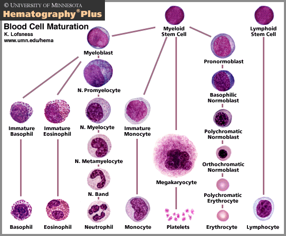

# Hematology

## Hematopoiesis

## Granules in Blood Cells

|Cell|Granule|Contents|
|-|-|-|
|Neutrophil|Specific granule|Leukocyte alkaline phosphatase (LAP) & Collagenase & Lactoferrin|
|Neutrophil|Azurophilic granule|Proteinases & Acid phosphatase & Myeloperoxidase & β-glucuronidase|
|Eosinophil|Eosinophilic granule|Histaminase & Major basic protein (MBP) & Eosinophil peroxidase & Eosinophil cationic protein|
|Basophil|Basophilic granule|Heparin & Histamine|
|Platelet|α granule|vWF & Fibrinogen & Fibronectin|
|Platelet|Dense granule|ADP & Calcium|

## Erythropoiesis

|Mnemonic|Site|
|-|-|
|Young|York sac|
|Liver|Liver|
|Synthesizes|Spleen|
|Blood|Bone marrow|

## Heme Synthesis

## Hemoglobin Genes

## Hemoglobin Variants

||α-Globin|Disease|α-Globin Defect|Disease|
|-|-|-|-|-|
|β-Globin|α2β2 [HbA]|-|β4 [HbH]|α-thalassemia :: 3 deletion|
|γ-Globin|α2γ2 [HbF]|β-thalassemia major|γ4 [Hb Barts]|α-thalassemia :: 4 deletion|
|δ-Globin|α2δ2 [HbA2]|β-thalassemia minor|-|-|
|s-Globin|α2s2 [HbS]|Sickle cell disease|-|-|
|c-Globin|α2c2 [HbC]|HbC disease|-|-|

## WBC Differential Counts

|Mnemonic|Cell|Ratio|
|-|-|-|
|Neutrophils|Neutrophil|60%|
|Like|Lymphocyte|30%|
|Making|Monocyte|6%|
|Everything|Eosinophil|3%|
|Better|Basophil|1%|

## Coagulation Pathway

## Myeloproliferative Disorders

|Tumors|Genetics|RBC|WBC|PLT|
|-|-|-|-|-|
|Polycythemia vera|JAK2|↑|↑|↑|
|Chronic myelogenous leukemia (CML)|t(9;22)|↓|↑|↑|
|Essential thrombocytosis|JAK2|-|-|↑|
|Myelofibrosis|JAK2|↓|?|?|

## Etiology of Anemia

### Microcytic Anemia {TAILS}

|Anemia|Fe|Ferritin|Transferrin [TIBC]|Saturation = Fe ÷ TIBC|
|-|-|-|-|-|
|Thalassemia|-|-|-|-|
|Anemia of chronic disorders|↓|↑ (1°)|↓|-|
|Iron deficiency anemia (IDA)|↓ (1°)|↓|↑|↓|
|Lead poisoning|↑ (1°)|↑|↓|↑|
|Sideroblastic anemia|↑ (1°)|↑|↓|↑|
|Hemochromatosis|↑ (1°)|↑|↓|↑|
|Pregnancy & OCP|-|-|↑ (1°)|↓|

## Difference Between Thalassemia and IDA

||Thalassemia|IDA|
|-|-|-|
|Mentzer index|< 13|> 13|
|RDW|-|↑|
|Iron profile|Normal|Abnormal|

### Normocytic Anemia :: Hemolytic Anemia

||Intravascular {TIMP}|Extravascular {PHAGES}|
|-|-|-|
|Peripheral smear|Schistocyte|Spherocyte|
|Haptoglobin|↓|-|
|Hemoglobin|↑|-|
|Hematuria|+|-|
|Serum indirect bilirubin|-|↑|
|Serum direct bilirubin|-|-|
|Urine bilirubin|-|-|
|Urine urobilinogen|-|↑|
|LDH|↑|↑|
|DAT|-|+|
|Jaundice|-|+|
|Examples|Transfusion|Pyruvate kinase deficiency|
||Infusion|HbC disease|
||Macroangiopathic hemolytic anemia (MAHA)|Hereditary spherocytosis|
||Microangiopathic hemolytic anemia (MAHA)|Autoimmune hemolytic anemia (AHA)|
||Paroxysmal nocturnal hematuria (PNH)|G6PD deficiency|
||-|Elliptocytosis|
||-|Sickle cell disease (SCD)|

## Etiology of Elevated RDW

- Iron deficiency anemia (IDA)	
- Folate deficiency anemia
- Vitamin B12 deficiency anemia
- Mixed anemia

## Etiology of Target Cells {HALT}

- HbC disease
- Asplenia
- Liver disease
- Thalassemia

## Presentation of Acute Intermittent Porphyria (AIP) {5P}

- Pain :: abdomen
- Port wine-colored urine
- Polyneuropathy
- Psychological disturbances
- Precipitation ← starvation & alcohol & drugs

## Treatment of Polycythemia

- Phlebotomy
- Antiplatelets :: Aspirin
- Cytoreductive agents :: Hydroxyurea & Interferon & Busulfan

## Leukemia & Lymphoma

### Myeloid Leukemia

|Tumors|Mutations|
|-|-|
|Acute myelogenous leukemia (AML)|t(15;17) → PML/RARA|
||t(8;21) → RUNX1/RUNX1T1|
||t(16;16) → CBFB/MYH11|
||NPM1|
||CEBPA|
||FLT3|
|Chronic myelogenous leukemia (CML)|t(9;22) → BCR/ABL1|

### Lymphoid Leukemia

|Tumors|Mutations|
|-|-|
|Acute lymphocytic leukemia (ALL)|t(12;21) → ETV6/RUNX1|
||t(1;19) → TCF3/PBX1|
||t(9;22) → BCR/ABL1|
||t(4;11) → MLL/AF4|
||Hyperdiploidy: > 50|
||Hypodiploidy: < 44|
|Chronic lymphocytic leukemia (CLL)|-|-|
|Hairy cell leukemia|-|-|

### T-cell Lymphoma {AM}

|Tumors|Mutations|
|-|-|
|Adult T-cell lymphoma|-|
|Mycosis fungoides & Sezary syndrome|-|

### B-cell Lymphoma {HBD-MMF}

|Tumors|Mutations|
|-|-|
|Hodgkin lymphoma|-|
|Burkitt lymphoma|t(8;14) → C-MYC/IGH|
|Diffuse large B-cell lymphoma (DLBCL)|-|
|Marginal zone lymphoma & MALT lymphoma|-|
|Mantle cell lymphoma|t(11;14) → Cyclin D (CCND)|
|Follicular lymphoma|t(14;18) → BCL2|

## B Symptoms of Hodgkin Lymphoma

- Fever
- Night sweats
- Weight loss

## Monoclonal Antibody Spike

- Multiple myeloma
- Monoclonal gammopathy of undetermined significance (MGUS)
- Waldenström macroglobulinemia

## Presentation of Multiple Myeloma {CRAB}

- Hypercalcemia
- Renal failure
- Rouleaux formation
- Russell body
- Anemia
- Amyloidosis :: primary
- Back pain
- Bone lesions
- Bence-Jones protein

## Approach to Multiple Myeloma

- Protein electrophoresis
- Bone marrow biopsy
- Skeletal survey

## Diagnosis of Multiple Myeloma

- Histology of bone marrow &/ tumors
	- Clonal bone marrow plasma cells > 10%
	- Plasmacytoma
- Evidence of end-organ damages {CRAB}
	- Hypercalcemia
	- Renal failure
	- Anemia
	- Bone lesions
- Evidence of inevitable end-organ damages
	- Free light chain (FLC) ratio > 100
	- Clonal bone marrow plasma cell > 60%
	- Bone lesions on MRI > 1

## Presentation of Hemophagocytic Lymphohisticytosis (HLH)

- Fever
- Ferritin ↑
- Hypertriglyceridemia
- Hemophagocytosis
- NK cell activity decreased
- Pancytopenia
- Rashes
- Splenomegaly

## Workup of Leukemia

- Peripheral blood smear
- Bone marrow smear
- Cytochemistry
- Immunophenotyping
- Karyotyping
- Genotyping

## Etiology of Hypocoagulability

|Etiology|Mechanism|PLT|BT|PT|PTT|
|-|-|-|-|-|-|
|Disseminated intravascular coagulation (DIC)|-|↓|↑|↑|↑|
|Thrombotic thrombocytopenic purpura (TTP)|↓ ADAMTS13|↓|↑|-|-|
|Hemolytic uremic syndrome (HUS)|Shiga & Shiga-like toxin|↓|↑|-|-|
|Immune thrombocytopenic purpura (ITP)|Anti-Gp1b & Anti-Gp2b/3a|↓|↑|-|-|
|Heparin-induced thrombocytopenia (HIT)|Anti-platelet factor 4 (Anti-PF4)|↓|↑|-|-|
|Von Willebrand disease (VWD)|↓ vWF|-|↑|-|↑|
|Bernard-Soulier disease (BSD)|↓ Gp1b|-|↑|-|-|
|Glanzmann disease|↓ Gp2b/3a|-|↑|-|-|
|Hemophilia A & B & C|↓ Factor 8 & 9 & 11|-|-|-|↑|
|Vitamin K deficiency|↓ Factor 2 & 7 & 9 & 10 & C & S|-|-|↑|↑|

## Etiology of Hypercoagulability

|Etiology|Mechanism|
|-|-|
|Factor 5 Leiden mutation|↑ Factor 5|
|Prothrombin gene mutation|↑ Factor 2|
|Antithrombin deficiency|↓ Antithrombin|
|Protein C/S deficiency|↓ Protein C/S|

## Etiology of Disseminated Intravascular Coagulation (DIC)

|Mnemonic|Cause|
|-|-|
|S|Sepsis :: GNB|
|T|Trauma|
|O|Obstetric complications|
|P|Pancreatitis :: acute|
|Making|Malignancy|
|New|Nephrotic symdrome|
|Thrombi|Transfusion|

## Pentad of Thrombotic Thrombocytopenic Purpura (TTP)

- Renal symptoms
- Anemia
- Thrombocytopenia
- Neurologic symptoms
- Fever

## Triad of Hemolytic Uremic Syndrome (HUS) {RAT}

- Renal symptoms
- Anemia
- Thrombocytopenia

## Mechanisms of Action of Antiplatelets

|Mechanism|Medication|Indications|
|-|-|-|
|Gp2b/3a inhibitors|Abciximab|Antiplatelet|
||Eptifibatide|Antiplatelet|
||Tirofiban|Antiplatelet|
|ADP antagonists|Clopidogrel|Antiplatelet|
||Prasugrel|Antiplatelet|
||Ticagrelor|Antiplatelet|
||Ticlopidine|Antiplatelet|
|PDE inhibitors|Dipyridamole|Antiplatelet|
||Cilostazol|Antiplatelet|
|COX inhibitors|NSAIDs|Antiplatelet|

## Mechanisms of Action of Anticoagulants

|Mechanism|Medication|Indications|
|-|-|-|
|VKOR inhibitors|Warfarin|Anticoagulant|
||Coumadin|Anticoagulant|
|Antithrombin inducers|UFH :: Heparin|Anticoagulant|
||LMWH :: Enoxaparin|Anticoagulant|
||LMWH :: Dalteparin|Anticoagulant|
|Factor 10a inhibitors|Apixaban|Anticoagulant|
||Rivaroxaban|Anticoagulant|
|Factor 2a inhibitors|Hirudin|Anticoagulant|
||Bivalirudin|Anticoagulant|
||Argatroban|Anticoagulant|
||Dabigatran|Anticoagulant|
|tPA inducers|Urokinase|Anticoagulant|
||Streptokinase|Anticoagulant|
||Alteplase|Anticoagulant|
||Reteplase|Anticoagulant|
||Tenecteplase|Anticoagulant|

## Targets of Anticoagulants

|Anticoagulants|Targets|
|-|-|
|VKOR inhibitors|Factor 2 & **7** & 9 & 10 & **Protein C/S**|
|Antithrombin|Factor **2** & 7 & 9 & **10** & 11 & 12|
|Plasmin|Factor 1|
|Protein C/S|Factor 5 & 8|

## Heparin Variants

||UFH|LMWH|
|-|-|-|
|Bioavailability|-|Better|
|Specificity to Factor 10a|-|Better|
|Monitor|PTT|-|
|Side Effect|HIT & Osteoporosis|-|
|Antidote|Protamine sulfate|-|

## Treatment of Thrombotic Thrombocytopenic Purpura (TTP)

- Immunosuppression :: Steroids & Rituximab
- Plasma exchange therapy (PEX)

## Treatment of Immune Thrombocytopenic Purpura (ITP)

- Immunosuppression :: Steroids & Rituximab
- Intravenous immunoglobulin (IVIG)
- Splenectomy
