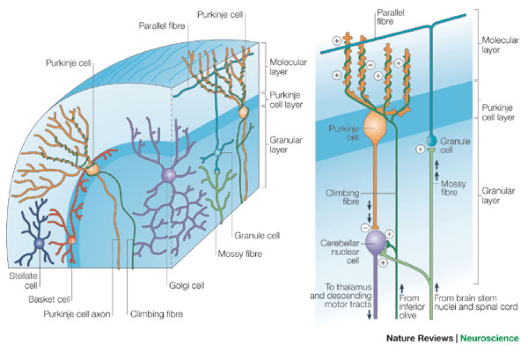
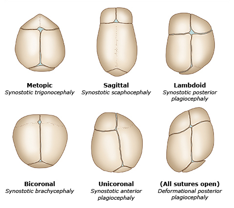

# Nervous System & Neurology

## Cerebral Cortex

### Layers

- Molecular layer
- External granular layer
- External pyramidal layer
- Internal granular layer
- Internal pyramidal layer
- Multiform layer

### Cells

- Horizontal [Cajal] cell
- Granular cell
- Pyramidal cell
- Fusiform cell
- Martinotti cell

## Cerebral Medulla

### Projections

- Corona radiata
- Internal capsule

### Associations

- Uncinate
- Superior longitudinal
- Inferior longitudinal
- Superior occipitofrontal
- Inferior occipitofrontal

### Commissures

- Fornix commissure
- Anterior commissure
- Corpus callosum

## Thalamus

|Nuclueus|Function|
|-|-|
|Lateral geniculate nucleus (LGN)|Vision|
|Medial geniculate nucleus (MGN)|Audition|
|Ventral anterior (VA) Ventral lateral (VL)|Motion|
|Ventral posterolateral (VPL)|Sensation below the neck|
|Ventral posteromedial (VPM)|Sensation above the neck|

## Hypothalamus

|Nuclueus|Function|
|-|-|
|Lateral|Hunger|
|Ventromedial|Satiety|
|Anterior|Parasympathetic|
|Posterior|Sympathetic|
|Suprachiasmatic|Circadian rhythm|
|Supraoptic|Vasopressin|
|Paraventricular|Oxytocin|

## Neurotransmitters and Hormones in Brain

|Secretion|Location|
|-|-|
|Acetylcholine|Basal nucleus of Meynert|
|Dopamine|Ventral tegmentum & Substantia nigra|
|Norepinephrine|Nucleus ceruleus|
|Serotonin|Raphe nucleus|
|GABA|Nucleus accumbens|
|Vasopressin|Supraoptic nucleus|
|Oxytocin|Paraventricular nucleus|
|Melatonin|Pineal gland|

## Cerebellum

### Layers

|Structure|Input|Output|
|-|-|-|
|Molecular layer|-|-|
|Purkinje layer|Cerebellar cortex|Cerebellar nuclei|
|Granular layer|Mossy fiber|Purkinje cell|

### Fibers

|Structure|Input|Output|
|-|-|-|
|Mossy fiber|Cerebrum & Spinal cord|Granule cell|
|Climbing fiber|Inferior olivary nucleus|Purkinje cell|

### Cells

|Structure|Input|Output|
|-|-|-|
|Basket cell|-|Purkinje cell|
|Stellate cell|-|Purkinje cell|
|Granule cell|Mossy fiber|Purkinje cell|
|Purkinje cell|Cerebellar cortex|Cerebellar nuclei|

### Nuclei

|Structure|Input|Output|
|-|-|-|
|Dentate nucleus|-|-|
|Emboliform nucleus|-|-|
|Globose nucleus|-|-|
|Fastigial nucleus|-|-|

## Cerebellum

## Basal Ganglion

## Basal Ganglia and Diseases

## Limbic System

- Fimbria
- Dentate gyrus
- Hippocampus
- Subiculum
- Cingulate gyrus
- Uncus
- Parahippocampus
- Amygdala

## Cerebral Circulation

## Sleep Stages

|Stage|Waves|
|-|-|
|Awake :: eyes open|β wave|
|Awake :: eyes closed|α wave|
|NREM sleep :: stage 1|θ wave|
|NREM sleep :: stage 2|Sleep spindles & K complexes|
|NREM sleep :: stage 3 & 4|δ wave|
|REM sleep|β wave|

## Groups of Cranial Nerves

|Group|Cranial Nerves|
|-|-|
|Pure sensory nerve|1 & 2 & 8|
|Pure motor nerve|3 & 4 & 6 & 11 & 12|
|Mixed and branchial arch innervation|5 & 7 & 9 & 10|
|Parasympathetic nucleus|3 & 7 & 9 & 10|
|Solitary nucleus|7 & 9 & 10|
|Ambiguous nucleus|9 & 10 & 11|

## Afferent Pathways

|Pathway|Function|1° Neuron|2° Neuron|3° Neuron|
|-|-|-|-|-|
|CN 1|SVA|Olfactory epithelium|Olfactory bulb|-|
|CN 2|SSA|Retina|Thalamus :: LGN|-|
|CN 5|GSA|Trigeminal ganglion|Trigeminal nucleus|Thalamus :: VPM|
|CN 7|SVA|Geniculate ganglion|Solitary nucleus|Thalamus|
|CN 8|SSA|Vestibular ganglion|Vestibular nucleus|Thalamus :: MGN|
|CN 8|SSA|Spiral ganglion|Cochlear nucleus|Thalamus :: MGN|
|CN 9|GVA|Superior & Inferior ganglion|Solitary nucleus|Thalamus|
|CN 10|GVA|Superior & Inferior ganglion|Solitary nucleus|Thalamus|

## Somatic Efferent Pathways

### Pyramidal

- Lateral corticospinal tract
- Ventral corticospinal tract

### Extrapyramidal

- Tectospinal tract
- Rubrospinal tract
- Vestibulospinal tract
- Reticulospinal tract

## Spinal Tracts

|Tract|Side|Functions|
|-|-|-|
|Dorsal column|Ipsilateral|Proprioception Touch Pressure Vibration|
|Spinothalamic tract|Contralateral|Pain Temperature|
|Lateral corticospinal tract|Contralateral|Motion|
|Ventral corticospinal tract|Ipsilateral|Motion|

## Pathway of Dorsal Column-Medial Lemniscus System

|Neuron|Level|Side|Structure|
|-|-|-|-|
|**1° Neuron**|Periphery|Ipsilateral|Peripheral nerve|
||Periphery|Ipsilateral|Dorsal root ganglion|
||Spinal cord|Ipsilateral|Dorsal column: Gracile fasciculus Cuneate fasciculus|
|**2° Neuron**|Medulla|Ipsilateral|Gracile nucleus Cuneate nucleus|
||Medulla|Decussation|Internal arcuate fiber|
||Medulla|Contralateral|Medial lemniscus|
|**3° Neuron**|Thalamus|Contralateral|VPL nucleus|
||Cerebrum|Contralateral|Internal capsule|
||Cerebrum|Contralateral|1°  somatic cortex|

## Pathway of Anterolateral System

|Neuron|Level|Side|Structure|
|-|-|-|-|
|**1° Neuron**|Periphery|Ipsilateral|Peripheral nerve|
||Periphery|Ipsilateral|Dorsal root ganglion|
|**2° Neuron**|Spinal cord|Ipsilateral|Substantia gelatinosa Nucleus proprius|
||Spinal cord|Decussation|Anterior white commissure|
||Spinal cord|Contralateral|Spinothalamic tract|
|**3° Neuron**|Thalamus|Contralateral|VPL nucleus|
||Cerebrum|Contralateral|Internal capsule|
||Cerebrum|Contralateral|1°  somatic cortex|

## Pathway of Corticospinal Tract

|Neuron|Level|Side|Structure|
|-|-|-|-|
|**1° Neuron**|Cerebrum|Ipsilateral|1° motor cortex|
||Cerebrum|Ipsilateral|Internal capsule|
||Midbrain|Ipsilateral|Cerebral peduncle|
||Medulla|Decussation|Pyramidal decussation|
||Spinal cord|Contralateral|Corticospinal tract|
|**2° Neuron**|Spinal cord|Contralateral|Anterior horn|
||Periphery|Contralateral|Ventral root|

## Levels of the Structures in the Spinal Cord

|Structure|Level|
|-|-|
|Cervical enlargement|C5 ~ T1|
|Lateral horn :: sympathetic|T1 ~ L2|
|Lumbosacral enlargement|L2 ~ S2|
|Lateral horn :: parasympathetic|S2 ~ S4|
|Cervical plexus|C5 ~ T1|
|Intercostal nerve|T1 ~ T11|
|Lumbosacral plexus|T12 ~ S4|
|Lumbar puncture|L3 ~ L5|

## Afferent Neurons

|Neuron|Fiber|Mnemonic|Sensation|
|-|-|-|-|
|I|-|Post|Proprioception|
|II|A-β|Traumatic|Touch Pressure Vibration|
|III|A-δ|Stress|Sharp pain Cold|
|IV|C|Disorder|Dull pain Warm|

## Autonomic Nervous System

### Sympathetic {ABSDE}

- Adrenal gland
- Blood vessels
- Sweat gland
- Dilator muscle of pupil
- Ejaculation

### Parasympathetic {CES}

- Ciliary muscle
- Erection
- Sphincter muscle of pupil

## Signalling Pathways of Neurotransmitters

|Pathways|Neurotransmitters|
|-|-|
|Ionotropic receptor|NN & NM & 5-HT3 & AMPA & NMDA & GABA-A & Glycine|
|GqPCR|M1 & M3 & α1 & 5-HT2 & H1|
|GsPCR|β1 & β2 & D1 & 5-HT4 & H2|
|GiPCR|M2 & α2 & D2 & 5-HT1 & GABA-B & Opioid|
|Receptor tyrosine kinase (RTK): AMPK pathway|-|
|Non-receptor tyrosine kinase (NRTK): JAK/STAT pathway|-|
|Steroid receptor|-|

## Neurotransmitters & Breakdown Products

|Neurotransmitter|Precursor|Breakdown Products|
|-|-|-|
|Acetylcholine (ACh)|-|Acetate & Choline|
|Dopamine (DA)|Tyrosine|Homovanillic acid (HVA)|
|Norepinephrine (NE)|Tyrosine|Vanillylmandelic acid (VMA)|
|Epinephrine|Tyrosine|Vanillylmandelic acid (VMA)|
|Serotonin (5-HT)|Tryptophan|5-hydroxyindoleacetic acid (5-HIAA)|
|Histamine|Histidine|-|
|Glutamate|Glutamate|-|
|GABA|Glutamate|-|
|Glycine|Glycine|-|
|Opioid|-|-|

## Factors Affecting Cerebral Blood Flow

## Craniosynostosis

|Type|Premature Suture|
|-|-|
|Trigonocephaly|Metopic|
|Scaphocephaly [Dolichocephaly]|Sagittal|
|Brachycephaly|Coronal|
|Plagiocephaly :: anterior|Unilateral coronal|
|Plagiocephaly :: posterior|Unilateral lambdoid|

## Primary Headaches

||Cluster|Migraine|Tension|
|-|-|-|-|
|Sex|Male|Female|-|
|Laterality|Unilateral|Unilateral / Bilateral|Bilateral|
|Location|Periorbital|Head|Band|
|Duration|15 minutes ~ 3 hours|4 hours ~ 3 days|30 minutes ~ 7 days|
|Triggers|-|+|+|

## Presentation of Horner Syndrome {MAP}

- Miosis
- Anhidrosis
- Ptosis :: superior tarsal muscle

## Brain Lesions & Breathing Patterns

|Brain Lesion|Respiratory Pattern|
|-|-|
|Cerebrum|Cheyne-Stokes respiration|
|Midbrain|Tachypnea|
|Upper pons|Apneustic respiration|
|Lower pons|Cluster respiration|
|Medulla|Ataxic [Biot] respiration|

## Aphasia

|Aphasia|Comprehension|Repetition|Fluency|
|-|-|-|-|
|Global|-|-|-|
|Broca|+|-|-|
|Wernicke|-|-|+|
|Conduction|+|-|+|
|Mixed transcortical|-|+|-|
|Transcortical motor|+|+|-|
|Transcortical sensory|-|+|+|

## Hemorrhage

### Extracranial

|Hemorrhage|Vessels|Cross Sutures|
|-|-|-|
|Caput succedaneum|Soft tissues|+|
|Subgaleal|Subgaleal vessels|+|
|Cephalohematoma|Subperiosteal vessels|-|

### Intracranial

|Hemorrhage|Vessels|Cross Sutures|
|-|-|-|
|Epidural|Middle meningeal artery|-|
|Subdural|Bridging veins|+|
|Subarachnoid|Aneurysm / AVM|+|
|Intraparenchymal|Microaneurysm|+|

## Cushing Triad of Increased Intracranial Pressure (ICP)

- Pressure :: hypertension & increased pulse pressure
- Pulse :: bradycardia
- Respiration :: pattern change

## Treatment of Increased Intracranial Pressure (ICP)

- Position :: head elevation
- Hyperventilation
- Diuretics :: Mannitol
- Sedation
- Craniectomy

## Treatment of Idiopathic Intracranial Hypertension (IIH)

- Weight loss
- Diuretics :: Acetazolemide & Loop diuretics
- Topiramate
- Lumbar puncture
- Shunting
- Optic nerve sheath fenestration

## Triad of Normal Pressure Hydrocephalus (NPH) {3W}

|Mnemonic|Presentation|
|-|-|
|Wet|Urinary incontinence|
|Wobbly|Ataxia|
|Wacky|Cognitive dysfunction|

## Contraindications for Lumbar Puncture

- Increased intracranial pressure (ICP)
- Bleeding tendency
- Suspected brain abscess

## Spinal Cord Lesions

|Lesion|Dorsal Column|Spinothalamic|Corticospinal|Anterior Horn|
|-|-|-|-|-|
|Poliomyelitis|-|-|-|+|
|Spinal muscular atrophy (SMA)|-|-|-|+|
|Amyotrophic lateral sclerosis (ALS)|-|-|+|+|
|Tabes dorsalis|+|-|-|-|
|Multiple sclerosis|+|+|-|-|
|Syringomyelia|-|-|-|-|
|Subacute combined degeneration|+|-|+|-|
|Anterior spinal artery syndrome|-|+|+|+|
|Brown-Sequard syndrome|+|+|+|+|

## Charcot Triad of Multiple Sclerosis {SIN}

- Scanning speech
- Intention tremor & Incontinence & Internuclear ophthalmoplegia
- Nystagmus

## Presentation of Parkinson Disease {PARTS}

- Postural instability
- Akinesia & Bradykinesia
- Rigidity :: cogwheel
- Tremor :: resting & pill-rolling
- Shuffling gait

## Extrapyramidal Symptoms (EPS) {DABT}

- Dystonia
- Akathisia
- Bradykinesia
- Tardive dyskinesia

## Classic Triad of Wernicke's Encephalopathy {CAO}

- Confusion
- Ataxia
- Ophthalmoplegia

## CNS & PNS Tumors

|Cell|Origin|Tumors|
|-|-|-|
|CNS neuron|Neuroectoderm|PNET :: Medulloblastoma|
|||PNET :: Retinoblastoma|
|Astrocyte|Neuroectoderm|Grade 1: Pilocytic astrocytoma|
|||Grade 2: Fibrillary astrocytoma|
|||Grade 3: Anaplastic astrocytoma|
|||Grade 4: Glioblastoma multiforme|
|Ependymal cell|Neuroectoderm|Ependymoma|
|Oligodendrocyte|Neuroectoderm|Oligodendroglioma|
|Endocrine cell|Surface ectoderm|Craniopharyngioma|
|||Pituitary adenoma|
|Microglia|Mesoderm|-|
|PNS neuron|Neural crest|-|
|Schwann cell|Neural crest|Schwannoma|

## Mechanisms of Action of Anticonvulsants

|Mechanism|Medication|Indications|
|-|-|-|
|GABA-A agonists|Barbiturate|Seizure|
||Benzodiazepine|Seizure|
|Na channel blockers|Carbamazepine|Seizure & Bipolar|
||Phenytoin|Seizure|
|Ca channel blockers|Ethosuximide|Seizure :: absence|
||Gabapentin|Seizure & Neuropathic pain|
||Pregabalin|Seizure & Neuropathic pain|
|↑ GABA|Valproate|Seizure & Bipolar|
|↑ GABA|Tiagabine|Seizure|
|↑ GABA|Vigabatrin|Seizure|
|↓ Glutamate|Levetiracetam|Seizure|
|-|Felbamate|Seizure|
|-|Topiramate|Seizure|
|-|Lamotrigine|Seizure|

## Mechanisms of Action of Medications for Huntington Disease

|Mechanism|Medication|Indications|
|-|-|-|
|Vesicular transporter inhibitors|Reserpine|Huntington|
||Tetrabenazine|Huntington|
|D2 antagonists|2° Antipsychotics|Huntington|

## Mechanisms of Action of Medications for Parkinson Disease

|Mechanism|Medication|Indications|
|-|-|-|
|M antagonists|Benztropine|Parkinson|
|D2 agonists|Bromocriptine|Parkinson|
||Pramipexole|Parkinson|
||Ropinirole|Parkinson|
|MAO inhibitors|Selegiline|Parkinson|
|COMT inhibitors|Capones|Parkinson|
|Dopa|Levodopa|Parkinson|
|Dopa decarboxylase inhibitors|Carbidopa|Parkinson|
||Benserazide|Parkinson|
|NMDA antagonists|Amantadine|Parkinson|

## Mechanisms of Action of Medications for Alzheimer Disease

|Mechanism|Medication|Indications|
|-|-|-|
|ACh esterase inhibitors|Rivastigmine|Alzheimer|
||Galantamine|Alzheimer|
||Donepezil|Alzheimer|
|NMDA antagonists|Memantine|Alzheimer|

## Risk of Progression of TIA to Stroke {ABCD2}

- Age :: ≥ 􏳧60 years
- BP :: ≥ 􏳧140/90
- Clinical features
  - Unilateral weakness
  - Speech impairment
- Duration
- Diabetes

## Neurological Examination for Hemineglect

- Cancellation test
- Reading test
- Bisection of lines
- Copy of drawings

## CSF Analysis

||Pressure|WBCs|Glucose|Protein|
|-|-|-|-|-|
|Normal|50 ~ 180 mmH2O|< 5/mm3|40 ~ 70 mg/dL|20 ~ 45 mg/dL|
|Bacterial|↑|↑ PMNs|↓|↑|
|TB & Fungal|↑|↑ Lymphocytes|↓|↑|
|Viral|↑|↑ Lymphocytes|-|↑|
|Guillain-Barre syndrome|-|↑ Lymphocytes|-|↑|

## Pathogens of Encephalitis

- Arbovirus
- Enterovirus
- HSV
- VZV
- CMV
- Toxoplasmosis
- Malaria

## Pathogens of Meningitis

- Streptococcus pneumonia
- Haemophilus influenzae
- Neisseria meningitidis
- Enterovirus
- HSV & HIV
- Cryptococcus

## Empirical Antibiotics for Meningitis

|Patient|Antibiotics|
|-|-|
|≤ 1 month|Ampicillin & (3° Cephalosporins / Aminoglycosides)|
|1 ~ 3 months|3° Cephalosporins & Vancomycin|
|3 months ~ 60 years|3° Cephalosporins & Vancomycin|
|≥ 60 years / Complicated|Ampicillin & 3° Cephalosporins & Vancomycin|

## Routes of Brain Abscess Transmission

- Hematogenous spread
- Direct spread
  - Paranasal sinusitis
  - Otitis media
  - Mastoiditis
  - Dental infection
- Direct innoculation
