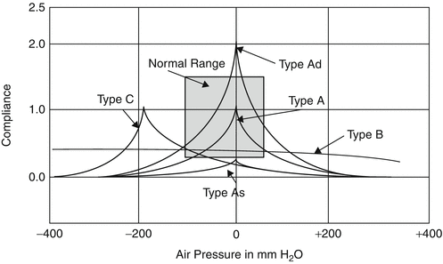

# Special Senses & Ophthalmology & Otolaryngology

## Layers of Cornea

- Epithelium
- Bowman's membrane
- Stroma
- Descemet's membrane
- Endothelium

## Pupillary Reflex

## Conjugate Eye Movements

## Vestibulo-ocular Reflex

## Etiology of Ophthalmoplegia & Nystagmus

- Cavernous sinus thrombosis
- Cerebellopontine angle tumor :: Bruns nystagmus
- Chiari malformation
- Epilepsy
- Idiopathic intracranial hypertension (IIH)
- Multiple sclerosis
- Myasthenic syndrome
- Parinaud syndrome :: convergence-retraction nystagmus
- Peripheral vestibular nystagmus
	- Benign paroxysmal positional vertigo (BPPV)
	- Labyrinthine concussion
	- Meniere disease
	- Vestibular neuritis
	- Vestibular schwannoma
- Posterior communicating artery aneurysm
- Stroke
- Thyroid ophthalmopathy
- Uncal herniation
- Wernicke's encephalopathy

## Mechanisms of Action of Medications for Glaucoma

|Mechanism|Medication|Indications|
|-|-|-|
|ACh esterase inhibitors|Organophosphate & Sarin|Glaucoma|
|M agonists|Cabachol|Glaucoma|
||Pilocarpine|Glaucoma|
|α2 agonists|Brimonidine|Glaucoma|
|β antagonists|Timolol|Glaucoma|
|PGF2 agonists|Latanoprost|Glaucoma|
|Carbonic anhydrase inhibitors|Acetazolamide|Glaucoma|

## Treatment of Dry Eye Disease (DED)

- Cyclosporine :: topical
- Lifitegrast :: topical
- Glucocorticoids :: topical
- Pilocarpine
- Punctal occlusion
- Autologous serum tears

## Physical Examinations for Hearing Loss

|Hearing Loss|Rinne Test|Weber Test|
|-|-|-|
|Normal|AC > BC|Left = Right|
|Sensorineural|AC > BC|Lesion < Normal|
|Conductive|AC < BC|Lesion > Normal|

- Air conduction (AC)
- Bone conduction (BC)

## Symbols of Audiogram

||Right|Left|
|-|-|-|
|Unmasked AC|○|☓|
|Unmasked BC|<|>|
|Masked AC|△|□|
|Masked BC|⊏|⊐|

## Examples of Audiogram

### Normal

### Conductive Hearing Loss

### Sensorineural Hearing Loss

### Mixed Hearing Loss

### Noise-induced Hearing Loss

### Presbycusis

### Meniere Disease

### Osteosclerosis

## Tympanometry

|Type|Interpretation|
|-|-|
|A|Normal|
|Ad|Ossicular chain dislocation|
|As|Tympanosclerosis|
|B|Perforation|
|C|Eustachian tube dysfunction|

## Pathogens of Otitis Media {SHM}

- Streptococcus pneumonia
- Haemophilus influenzae
- Moraxella catarrhalis

## Treatment of Nonallergic Rhinitis (NAR)

- Glucocorticoids :: intranasal
- Antihistamine :: intranasal
- 1° antihistamine :: oral

## Pathogens of Sinusitis {SHM}

- Streptococcus pneumonia
- Haemophilus influenzae
- Moraxella catarrhalis

## Pathogens of Tonsillitis

- Group A streptococcus (GAS)
- Adenovirus
- HSV
- EBV
- Parainfluenza virus
- Influenza virus
