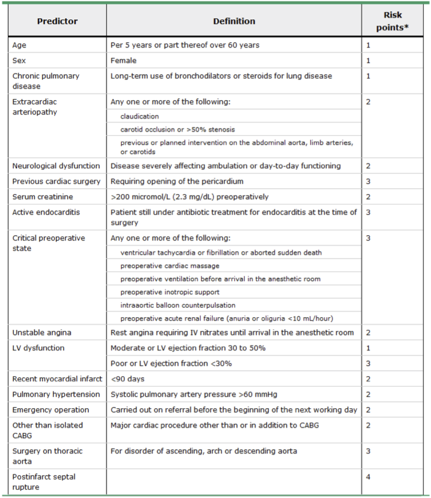

# Surgery

## Preoperative Evaluations

### ASA Physical Status Classification

|Class|Definition|
|-|-|
|1|Normal healthy|
|2|Mild systemic disease|
|3|Severe systemic disease|
|4|Life-threatening systemic disease|
|5|Moribund|
|6|Brain-dead|

### Metabolic Equivalent (MET)

.jpg)

### Mallampati Classification

### EuroSCORE

|Risk|Points|Mortality|
|-|-|-|
|Low|0 ~ 2|1.3%|
|Medium|3 ~ 5|2.9%|
|High|≥ 6|10.9 ~ 11.5%|

## Minimal Fasting Time

|Product|Time|
|-|-|
|Clear liquid|2 hours|
|Human milk|4 hours|
|Light meal|6 hours|
|Regular meal|8 hours|

## Therapeutic Intervention Scoring System (TISS)

.png)

## Acute Physiology and Chronic Health Evaluation (APACHE) II

- Temperature :: rectum
- Heart rate (HR)
- Mean arterial pressure (MAP)
- Respiratory rate (RR)
- Oxygenation: PaO2/FiO2 (PF) ratio
- Arterial pH
- Sodium
- Potassium
- Creatinine
- Hematocrit
- White blood cell count
- Glasgow Coma Scale (GCS)

## Crystalloids

|Solution|Na (mEq/L)|K (mEq/L)|Ca (mg/dL)|Cl (mEq/L)|Glucose (g/dL)|pH|
|-|-|-|-|-|-|-|
|Normal saline (NS)|154|0|0|154|0|4.5 ~ 7|
|Ringer's lactate|130|4|1.35|109|0|6 ~ 7.5|
|Ringer's acetate|130|5|1|112|0|6 ~ 8|
|5% dextrose in water (D5W)|0|0|0|0|5|3.5 ~ 6.5|
|5% dextrose in normal saline (D5NS)|154|0|0|154|5|3.5 ~ 6.5|

## Etiology of Postoperative Fever {5W}

|Mnemonic|Etiology|POD|
|-|-|-|
|Wind|Pneumonia & Atelectasis|1 ~ 3|
|Water|Sepsis & UTI|3 ~ 5|
|Wound|Surgical site infection (SSI)|5 ~ 7|
|Walking|DVT & PE|> 5|
|Wonder|Drugs|-|

## Ventilator Modes

|Sequence|Control|Trigger|Mode|
|-|-|-|-|
|Continuous mandatory|Presure (PC) / Volume (VC)|Time|Assist-control ventilation (ACV)|
|Intermittent mandatory|Presure (PC) / Volume (VC)|Time & Patient|Synchronized intermittent mandatory ventilation (SIMV)|
|Continuous spontaneous|-|Patient|Pressure support ventilation (PSV)|

## Ventilation Weaning Parameters

|Parameter|Normal Adult Range|Weaning Threshold|
|-|-|-|
|Respiratory Rate (RR)|14 ~ 18|< 40|
|Tidal Volume (VT)|5 ~ 7 mL/kg|5 mL/kg|
|Rapid shallow breathing index (RSBI) = RR ÷ VT|< 50/min/L|< 105/min/L|
|PF Ratio = PaO2 ÷ FiO2|> 400|> 200|
|Max Inspiratory Pressure|< -90 cm H2O|< -25 cm H2O|

## Surgical Wound Classification

|Wound|Flora|Spillage|Inflammation|Pus|
|-|-|-|
|Clean|-|-|-|-|
|Clean-contaminated|+|-||-|
|Contaminated|+|+|+|-|
|Dirty|+|+|+|+|

## Types of Wound Healing

## Types of Skin Grafts

## Types of Flaps

### Blood Supply

- Random
- Axial
	- Pedicled
	- Free

### Proximity

- Local
- Regional
- Distant

### Composition

- Skin
- Muscle
- Musculocutaneous
- Fasciocutaneous
- Osteocutaneous

## Wagner Classification for Diabetic Foot Ulcers

|Stage|Description|
|-|-|
|1|Skin|
|2|Deep w/o abscess|
|3|Osteomyelitits|
|4|Localized gangrene|
|5|Extensive gangrene|

## Wallace Rule of Nines

